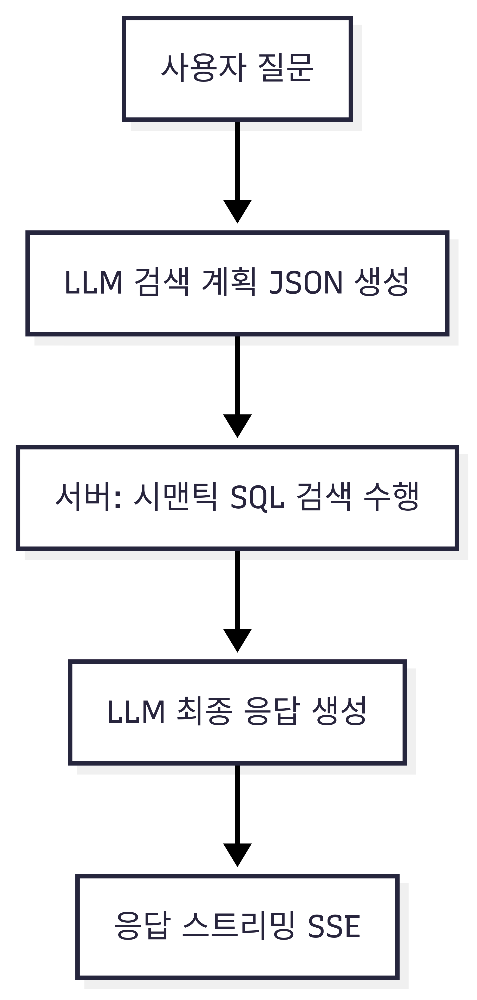

# 보고서: /ai/v2/ask — 구조, 동작, 하이브리드 검색 계획

## 1) 개요
- 목표: v1의 고정형 RAG 한계를 보완. “검색 계획(JSON)”을 LLM이 생성 → 서버가 안전하게 표준화/검증 → 시맨틱/하이브리드 검색 수행 → 최종 답변을 SSE로 스트리밍.
- 상태: `POST /ai/v2/ask`(SSE) 운영 중. v1은 유지하며, v2에서 계획 기반 검색과 관측성을 강화.

## 2) v1의 한계와 v2 도입 효과
- 고정 파라미터 → 동적 계획
  - v1: 임계치(0.2), LIMIT(5), 가중치(0.7/0.3) 등 고정.
  - v2: `top_k`, `threshold`, `weights`, `sort`, `limit`을 질문/맥락에 맞게 동적 제어(서버가 범위 강제).
- 시간/정렬 의도 미반영 → 자연어 시간 해석
  - v1: “최근/지난주/9월/작년” 같은 시간 의도 반영 불가.
  - v2: `filters.time`(상대/월/분기/연도)을 받아 `KST 절대범위(from/to)`로 변환해 쿼리에 반영.
- 리콜/정밀도 균형 한계 → 하이브리드
  - v1: 임베딩 기반 RAG만.
  - v2: 벡터+텍스트 하이브리드 융합으로 재현율 향상 및 키워드 민감 질의 대응.
- 관측성 부족 → SSE 메타 이벤트
  - v1: 검색/선택 근거가 불투명.
  - v2: `search_plan`, `rewrite`, `keywords`, `hybrid_result`, `search_result` 등으로 의사결정 가시화.
- 안전성/정합성
  - v1: 클라이언트 입력 이탈 감지 어려움.
  - v2: JSON Schema(strict) + Zod 검증 + 필터 강제 주입으로 안전한 실행계획만 수행.
- 비용/토큰 관리
  - v1: 고정 상수로 세밀한 제어 어려움.
  - v2: `top_k`/향후 `limit`/dedupe로 토큰 예산을 상황별 최적화 가능.



## 3) 검색 계획(Planner)과 안전 표준화
- 타입/스키마(`src/types/ai.v2.types.ts`)
  - `mode`: `rag | post`
  - `top_k`(1..10), `threshold`(0..1), `weights`(`chunk`,`title`; 합 1로 정규화)
  - `filters`: `{ user_id, category_ids?, post_id?, time? }`
  - `sort`: `created_at_desc | created_at_asc`, `limit`(1..20)
  - `hybrid`: `{ enabled, retrieval_bias, alpha?, max_rewrites, max_keywords }`
  - `rewrites`: string[], `keywords`: string[]
- 프롬프트 규칙(`src/prompts/qa.v2.prompts.ts`)
  - 서버 제공 필터(`user_id`, `category_id`, `post_id`)는 고정(FIXED)이며 변경 금지.
  - 플래너는 `top_k`, `threshold`, `filters.time`, `sort`, `limit`, `hybrid`, `rewrites`, `keywords`만 결정.
  - 하이브리드 시 `hybrid.retrieval_bias ∈ {lexical, balanced, semantic}` 라벨을 결정.
- 생성/정규화(`src/services/search-plan.service.ts`)
  - OpenAI Responses(JSON Schema strict) → Zod 파싱/검증.
  - 값 범위 강제, `weights` 합 1로 정규화.
  - 불용어/중복 제거로 `rewrites`/`keywords` 정제.
  - 시간 필터를 `KST 절대범위`로 변환(`src/utils/time.ts`).
  - `retrieval_bias → alpha` 매핑(서버): `lexical→0.3`, `balanced→0.5`, `semantic→0.75`(필요 시 서버가 `alpha`를 직접 클램프/주입).
  - `user_id/category_id/post_id`는 서버가 최종 주입(정합성 보장). 실패 시 v1 RAG 폴백.

## 4) 검색 엔진: 시맨틱 + 하이브리드
- 시맨틱(`src/services/semantic-search.service.ts` → `findSimilarChunksV2`)
  - 입력: 질문 임베딩, `threshold/top_k/weights/sort`, 카테고리/시간 필터.
  - 점수: `w_chunk*(1 - chunk_dist) + w_title*(1 - title_dist)`.
  - 저장소: `postRepository.findSimilarChunksV2(...)` 호출, 파라미터 바인딩 기반 안전 쿼리.
- 하이브리드(`src/services/hybrid-search.service.ts`)
  - 입력: 원 질문 + `rewrites`(재작성), `keywords`(키워드), `alpha`(서버 매핑).
  - 벡터 경로: 각 query 임베딩 → 시맨틱 후보 수집 → 동일 청크는 최대 vecScore로 병합.
  - 텍스트 경로: `textSearchChunksV2`(키워드/질의 기반 텍스트 검색) → 동일 청크는 최대 textScore로 병합.
  - 정규화/융합: min-max 정규화 후 `score = alpha*vec + (1-alpha)*text`로 결합 → 상위 `top_k`를 반환.
  - 폴백: 하이브리드 결과 비었을 때 시맨틱 경로로 재시도.
  - SSE 메타: `rewrite`, `keywords`, `hybrid_result`로 중간 산출물/요약을 별도 송신.


## 5) 파이프라인(SSE 이벤트)과 모드
- 컨트롤/오케스트레이션
  - `src/controllers/ai.v2.controller.ts`: SSE 헤더, 스트림 라우팅.
  - `src/services/qa.v2.service.ts`: 계획 생성 → 검색 실행(하이브리드/시맨틱) → LLM 호출까지 오케스트레이션.
- post 모드(`post_id` 존재)
  - 접근 정책: `post.is_public=false`면 소유자만(403), 미존재 시 404.
  - 이벤트: `search_plan`(간략) → `search_result` → `exist_in_post_status:true` → `context` → `answer`* → `end`.
  - 컨텍스트: 해당 글 본문만 사용(전처리 후). 하이브리드 미사용.
- rag/하이브리드 모드
  - 이벤트 순서(일반):
    1) `search_plan`: 정규화된 계획(JSON). `hybrid.enabled`가 true면 `retrieval_bias`와 서버 계산 `alpha`가 함께 포함.
    2) `rewrite`(선택): 계획의 재작성 질의 목록.
    3) `keywords`(선택): 계획의 핵심 키워드 목록.
    4) `hybrid_result`(선택): 하이브리드 후보 요약.
    5) `search_result`: 최종 컨텍스트 요약.
    6) `exist_in_post_status`: `true | false`.
    7) `context`: `[ { postId, postTitle }, ... ]`.
    8) `answer`*: 모델 부분 응답.
    9) `end`: 종료 시그널(`[DONE]`).
  - 오류 시: `error` 송신.

## 6) LLM/비용/프로바이더
- 기본 모델: `openai/gpt-5-mini`(환경변수로 변경 가능), 임베딩: `text-embedding-3-small`.
- OpenAI: Responses API 스트리밍 우선, 실패 시 논스트림/Chat Completions 폴백.
- Gemini: 현재 논스트림 결과를 SSE 청크로 분할 전송.
- 비용 로깅: 프롬프트/완료 토큰 및 추정 비용 로깅(`src/llm/*`).
- 툴콜: 컨텍스트 부족 시 `report_content_insufficient` 툴을 통해 안내 문구 유도.

## 7) 보안·정합성
- 생성 계획 방어선: JSON Schema(strict) + Zod 검증 + 서버 측 범위 강제.
- 필터 주입: `user_id/category_id/post_id`는 서버가 최종 주입하여 일탈 방지.
- SQL 안전성: 파라미터 바인딩/화이트리스트 템플릿.
- 데이터 최소화: SSE에는 ID/제목 위주 요약만 전송.
- 접근 제어: post 모드에서 `is_public`/소유자 검사.

## 8) 현재 동작과 한계(향후 과제)
- 현재
  - `top_k`로 리콜 폭 제어, 시맨틱/하이브리드 모두 적용.
  - `limit`은 계획에는 존재하나 컨텍스트 축약에는 미적용(향후 포스트 단위 dedupe와 함께 적용 예정).
  - 청크 단위 랭킹 → 동일 포스트 다수 노출 가능.
  - 카테고리 배열은 첫 항목만 반영.
- 향후
  - 포스트 단위 dedupe + `limit` 적용으로 다양성/비용 균형.
  - `retrieval_bias → alpha` 매핑의 AB 테스트/텔레메트리 튜닝(예: {0.25,0.5,0.8}).
  - 점수 정규화 고도화(z-score/quantile) 및 RRF 옵션 도입 검토.
  - 텍스트 경로 향상(전처리/순위 함수/키워드 확장) 및 프로바이더 다변화.
  - SSE `search_sql`/`search_debug`로 투명성 강화.

## 9) 파일 맵(핵심)
- 라우트/컨트롤러: `src/routes/ai.v2.routes.ts`, `src/controllers/ai.v2.controller.ts`, `src/app.ts`
- 플래너/타입/프롬프트: `src/services/search-plan.service.ts`, `src/types/ai.v2.types.ts`, `src/prompts/qa.v2.prompts.ts`
- 시간 유틸: `src/utils/time.ts`
- 검색: `src/services/semantic-search.service.ts`, `src/services/hybrid-search.service.ts`, `src/repositories/post.repository.ts`
- 오케스트레이션: `src/services/qa.v2.service.ts`
- LLM: `src/llm/*`

## 10) 예시
- 요청
```json
{
  "question": "지난달 프로젝트 X 관련 핵심만 3개 보여줘",
  "user_id": "u_123",
  "category_id": 3,
  "llm": { "provider": "openai", "options": { "temperature": 0.2 } }
}
```
- 이벤트 예시
  - `search_plan`(rag, time=지난달, top_k/threshold/weights/sort/limit/hybrid 포함; hybrid.retrieval_bias와 서버 주입 alpha 함께 표기)
  - `rewrite`/`keywords`(선택)
  - `hybrid_result`(선택)
  - `search_result` → `exist_in_post_status` → `context` → `answer`* → `end`
