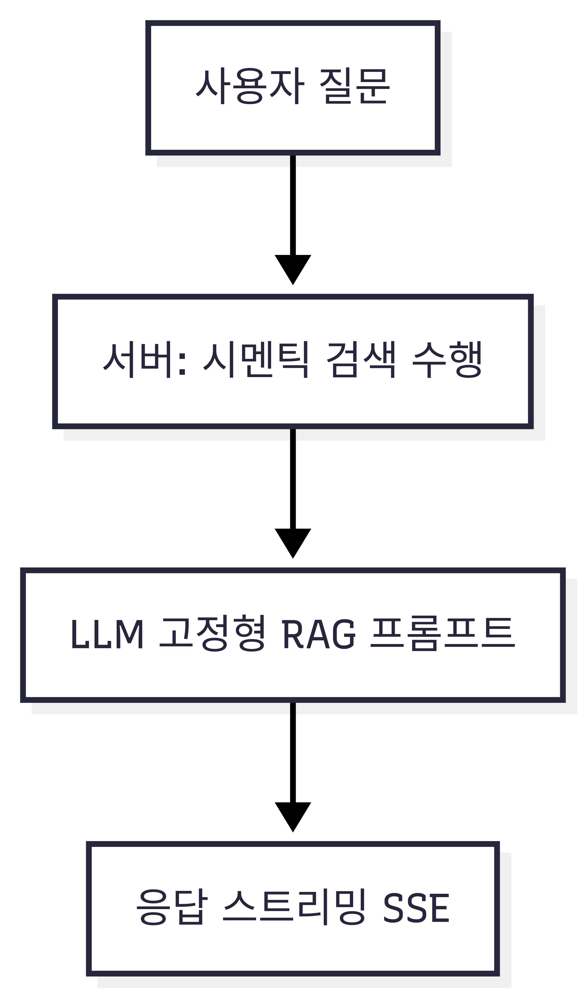

# 보고서: /ai/v2/ask — 동작 방식, 하이브리드 서치, 검색 계획

## 1) 개요
- 목표: v1의 고정형 RAG 한계를 보완. “검색 계획(JSON)”을 LLM이 생성 → 서버가 안전하게 표준화/검증 → 시맨틱/하이브리드 검색 수행 → 최종 답변을 SSE로 스트리밍.
- 상태: `POST /ai/v2/ask`(SSE) 운영 중. v1은 유지하며, v2에서 계획 기반 검색·관측성을 추가.

## 2) v1의 한계와 v2가 해결한 점
- 고정 파라미터 문제 → 동적 계획
  - v1: 임계치(0.2), LIMIT(5), 가중치(0.7/0.3) 고정.
  - v2: `top_k`, `threshold`, `weights`, `sort`, `limit`을 계획으로 동적 제어(서버가 범위 강제).
- 시간/정렬 의도 미흡 → 자연어 시간 해석
  - v1: “최근/지난주/9월/작년” 반영 불가.
  - v2: `filters.time`에 상대/월/분기/연도 표현 → `KST 절대범위(from/to)`로 변환해 쿼리에 반영.
- 컨텍스트 제어/비용 → 토큰 예산 컨트롤
  - v1: 컨텍스트 폭 조절 한계.
  - v2: `top_k`(리콜 폭), `limit`(노출 개수; 현재 미적용)로 조절 가능. 향후 dedupe/limit 적용 예정.
- 관측성 부족 → SSE 메타 이벤트 확장
  - v1: 검색 근거 불투명.
  - v2: `search_plan`, `rewrite`, `keywords`, `hybrid_result`, `search_result` 등으로 의사결정 가시화.
- 검색 방식 단일 → 하이브리드 도입
  - v1: 임베딩 기반 RAG만.
  - v2: 벡터+텍스트 하이브리드 융합으로 재현율/정확도 개선.



## 3) 검색 계획(Planner)과 안전 표준화
- 스키마(`src/types/ai.v2.types.ts`)
  - `mode`: `rag|post`
  - `top_k`(1..10), `threshold`(0..1), `weights`(`chunk`,`title`)
  - `filters`: `{ user_id, category_ids?, post_id?, time? }`
  - `sort`: `created_at_desc|created_at_asc`, `limit`(1..20)
  - `hybrid`: `{ enabled, alpha, max_rewrites, max_keywords }`, `rewrites`: string[], `keywords`: string[]
- 프롬프트 규칙 강화(`src/prompts/qa.v2.prompts.ts`)
  - 서버 제공 필터(`user_id`, `category_id`, `post_id`)는 고정(FIXED)이며 변경 금지.
  - 플래너는 `top_k`, `threshold`, `filters.time`, `sort`, `limit`, `hybrid`, `rewrites`, `keywords`만 결정.
- 생성/정규화(`src/services/search-plan.service.ts`)
  - OpenAI Responses API(JSON Schema strict) → Zod 파싱/검증.
  - 값 범위 강제, 가중치 합 1로 정규화, 불용어/중복 제거로 `rewrites`/`keywords` 정제.
  - 시간 필터를 `KST 절대범위`로 변환(`src/utils/time.ts`).
  - 카테고리/포스트 ID는 서버가 최종 주입(정합성 보장). 실패 시 v1 RAG 폴백.

## 4) 검색 엔진: 시맨틱 + 하이브리드
- 시맨틱(`src/services/semantic-search.service.ts` → `findSimilarChunksV2`)
  - 입력: 질문 임베딩, `threshold/top_k/weights/sort`, 카테고리/시간 필터.
  - 점수: `w_chunk*(1 - chunk_dist) + w_title*(1 - title_dist)`.
  - SQL: 파라미터 바인딩/화이트리스트 템플릿.
- 하이브리드(`src/services/hybrid-search.service.ts`)
  - 입력: 원 질문 + `rewrites`(재작성), `keywords`(키워드), `alpha`.
  - 벡터 경로: 각 query 임베딩 → 시맨틱 검색 → 동일 청크는 최대 vecScore로 병합.
  - 텍스트 경로: ILIKE/텍스트 유사도 기반 `textSearchChunksV2` → 최대 textScore로 병합.
  - 정규화/융합: min-max 정규화 후 `score = alpha*vec + (1-alpha)*text`로 랭킹 → 상위 `top_k` 반환.
  - SSE: `rewrite`, `keywords`, `hybrid_result` 이벤트로 중간 산출물/요약 제공.
- 폴백: 하이브리드 결과가 비어있으면 시맨틱 경로로 재시도.


## 5) 파이프라인(SSE 이벤트)과 모드
- 컨트롤러/오케스트레이터
  - `src/controllers/ai.v2.controller.ts`: SSE 헤더 설정, 서비스 파이프.
  - `src/services/qa.v2.service.ts`: 계획 생성→검색→LLM 호출까지 오케스트레이션.
- post 모드(post_id 존재)
  - 접근 정책: `post.is_public=false`면 소유자만(403), `true`면 공개. 미존재 404.
  - 이벤트: `search_plan`(합성) → `search_result` → `exist_in_post_status:true` → `context` → `answer`* → `end`.
  - 컨텍스트: 단일 글 본문(가공) 사용. RAG/하이브리드 미사용.
- rag/하이브리드 모드
  - 일반 흐름:
    1) `search_plan`(정규화된 계획)
    2) `rewrite`(선택)
    3) `keywords`(선택)
    4) `hybrid_result`(선택)
    5) `search_result`
    6) `exist_in_post_status`
    7) `context`
    8) `answer`* → `end`
  - 오류 시: `error` 송신.

## 6) LLM/비용/프로바이더
- 기본 모델: `openai/gpt-5-mini`(환경변수로 변경 가능), 임베딩: `text-embedding-3-small`.
- OpenAI: GPT‑5 Responses API 스트리밍 우선, 실패 시 논스트림/Chat Completions 폴백. 툴콜 인자도 `answer` 청크로 송신.
- Gemini: 현재 논스트림 결과를 SSE 청크로 전송.
- 비용 로깅: 프롬프트/완료 토큰, 추정 비용 로깅(`src/llm/index.ts`).

## 7) 보안·정합성
- JSON Schema + Zod 검증 + 범위 강제.
- 서버가 `user_id/category_id/post_id` 필터를 최종 강제(LLM 변조 무력화).
- SQL 파라미터 바인딩/템플릿 화이트리스트.
- SSE 데이터 최소화(제목/ID/요약만).
- post 모드 접근 제어: `is_public` 조건 기반.

## 8) 현재 동작과 한계(향후 과제)
- 현재
  - `top_k`로 리콜 폭 제어, 시맨틱/하이브리드 모두 적용.
  - `limit`은 계획에 있으나 컨텍스트 축약에는 아직 미적용(Top‑K 청크를 그대로 사용).
  - 청크 기준 컨텍스트로 포스트 중복 가능.
  - 카테고리 배열은 첫 항목만 반영.
- 향후
  - 포스트 단위 dedupe + `limit` 적용(윈도우 함수 등)으로 비용/다양성 균형.
  - 다중 카테고리 필터 완전 반영.
  - `search_sql`/`search_debug` 이벤트로 쿼리/파라미터 노출.
  - 텍스트 경로 고도화(순위 함수/전처리/키워드 확장), 모델 프로바이더 다양화.

## 9) 파일 맵(핵심)
- 라우트/컨트롤러: `src/routes/ai.v2.routes.ts`, `src/controllers/ai.v2.controller.ts`, `src/app.ts`
- 플래너/타입/프롬프트: `src/services/search-plan.service.ts`, `src/types/ai.v2.types.ts`, `src/prompts/qa.v2.prompts.ts`
- 시간 유틸: `src/utils/time.ts`
- 검색: `src/services/semantic-search.service.ts`, `src/services/hybrid-search.service.ts`, `src/repositories/post.repository.ts`
- 오케스트레이션: `src/services/qa.v2.service.ts`
- LLM: `src/llm/*`

## 10) 예시
- 요청
```json
{
  "question": "지난달 프로젝트 X 관련 핵심만 3개 보여줘",
  "user_id": "u_123",
  "category_id": 3,
  "llm": { "provider": "openai", "options": { "temperature": 0.2 } }
}
```
- 이벤트 예시
  - `search_plan`(rag, time=지난달, top_k/threshold/weights/sort/limit/hybrid 포함)
  - `rewrite`/`keywords`(선택)
  - `hybrid_result`(선택)
  - `search_result` → `exist_in_post_status` → `context` → `answer`* → `end`
